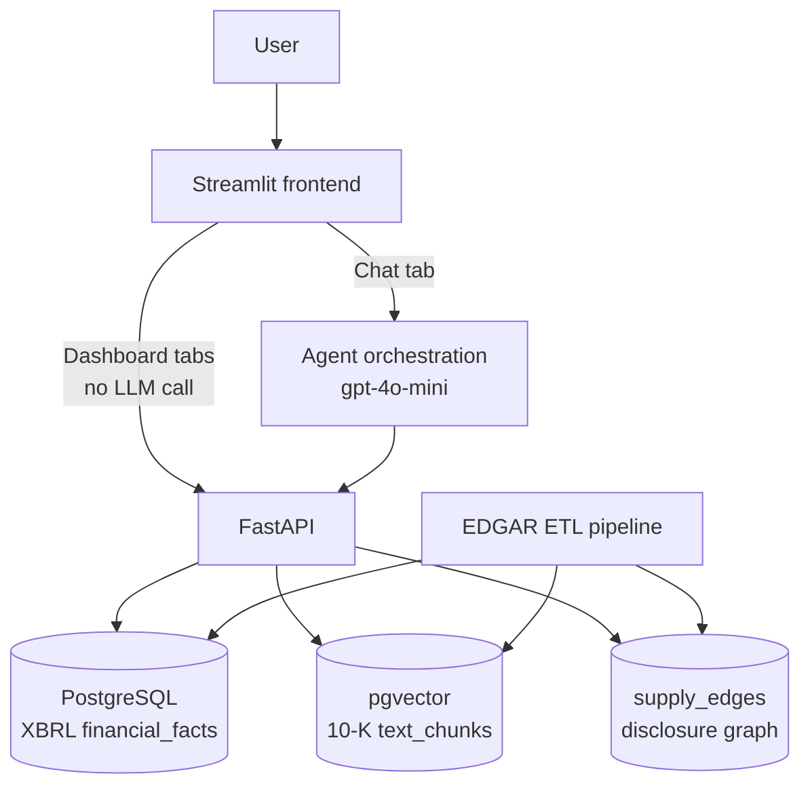

# Verifiable Supply-Chain Risk Copilot

A trustworthy risk-analysis tool for Apple's supply chain: every number is backed by SQL/XBRL, every supplier relationship is backed by structured extraction from 10-K disclosures with per-edge provenance, and every conclusion traces back to a specific SEC filing.

Runs locally against a bundled 9 MB data snapshot — see [Local Setup](#local-setup). *(An earlier hosted demo has been taken down; its database no longer exists, and a link that looks alive but fails on use is worse than none.)*

**New to this repo?** The companion [Financial-Copilot Handbook](https://github.com/renxiang-ch/Financial-copilot-handbook) walks through *why* this system is built the way it is — a request traced end to end through routing, tool calls, and verification, before you run a command — pinned to this repo's `v1.0-teaching` tag.

<!-- TODO: demo GIF/video goes here — record a ~30s walkthrough of the Chat tab
     answering a supply-chain exposure question, plus the Company Exposure View.
     Not generated by this change; needs a manual screen recording. -->

---

## What It Does

Two ways in, one source of truth:

- **Chat** — free-form analyst questions ("Which suppliers are most exposed if Apple cuts orders 20%?"), answered by an agent with tool access to SQL and a structured relationship table built from 10-K disclosures
- **Analyst Dashboard** — three pre-built views over the same data, no LLM call required: Company Exposure (who supplies Apple, and how dependent are they), Supplier Deep Dive (one supplier's dependency/revenue trend over time), What-if Scenario (dollar impact of an order cut, ranked by exposure)

Under both:
- Numbers are fetched from XBRL structured data and verified against SEC filings — **never computed by the LLM**
- Supplier relationships come from structured relationship extraction over 10-K customer-concentration disclosures, with per-edge provenance (accession number + verbatim quoted sentence). The bundled snapshot spans a 15-company pool — 128 edges (103 named), spanning FY2014–FY2026, with nine named Apple suppliers: ADI, APH, AVGO, CRUS, JBL, QCOM, QRVO, SWKS, TXN
- Correctly refuses unanswerable questions ("cannot determine from available data") instead of fabricating

<!-- TODO: dashboard screenshots go here — three images:
     1. Company Exposure View (radial cluster diagram, AAPL at center)
     2. Supplier Deep Dive (dependency + revenue trend lines for one supplier)
     3. What-if Scenario (ranked bar chart + separated floor-estimate section)
     Not generated by this change; needs manual screen capture from a running instance. -->

---

## Evaluation Results

*Benchmarked against this repo's own bundled snapshot (see [Local Setup](#local-setup)) — the same 15-company, 128-edge database a fresh clone loads. Every result file records a `db_fingerprint`; the numbers below are traceable back to a specific data state, not a moving target. The eval set is frozen for regression testing.*

### Tier 1–2 Benchmark (33 questions; 3 since retired) — eval-driven iteration

| Run | Tier-1 | Tier-2 | Retrieval | Refusal | Overall |
|---|---|---|---|---|---|
| Baseline (first run) | 100% | 80% | 50% | 80% | 78.8% |
| v2 (after negative-extraction + refusal fixes) | 100% | 100% | 62.5% | 100% | 90.9% |
| **Current** (2026-08-25, 30 active questions) | **100%** | **100%** | **42.9%** | **100%** | **86.7%** |

Numeric accuracy and refusal correctness have held at 100% since v2. Retrieval fluctuates run-to-run (25–62.5% historically) — see **Known Limitations** below; single-run movement inside that band is noise, not signal. Three questions have been retired since v2 — two refusal questions whose premise expired when the metrics they ask about (free cash flow, debt-to-equity inputs) were later ingested and became answerable, and one retrieval question whose golden phrase does not exist in the fiscal year it asks about — which is why the current row scores 30 questions. Current run: cost $0.033 / 30 questions, avg latency 3.72s/question, and the post-hoc answer verifier checked 32 stated figures with 0 flagged.

### Tier-3 Supply-Chain Ablation (8 questions)

| | Graph-augmented | Baseline (no graph) | Delta |
|---|---|---|---|
| **Overall accuracy** | **100%** (8/8) | 12.5% (1/8) | **+87.5pp** |
| Avg latency | 5.45s | 10.33s | faster |
| Cost / run | $0.008 | $0.024 | cheaper |

The +87.5pp gap is the structured-extraction layer's contribution. Baseline naive-RAG cannot answer supply-chain exposure questions — it fails by reversing Apple's revenue or refusing outright.

### Known Limitations

- **Eval set scale** — 33 Tier-1/2 questions + 8 Tier-3 questions is enough to catch regressions and demonstrate the methodology, not a large-scale benchmark. Numbers above should be read as "this system was measured this way," not "this system is production-grade at scale."
- **Threshold-only disclosures understate real exposure** — some 10-Ks disclose only "more than ten percent" with no exact figure (e.g. SWKS's Apple dependency). The system floors these at 10% for dollar-impact calculations, which is a documented *lower bound*, not the true number — SWKS's actual Apple dependency is closer to ~69% per third-party WRDS data. The dashboard now visually separates these from exact-disclosure rankings (see [What-if Scenario Tool](#what-it-does)) rather than mixing them into one ranked list.
- **Entity alignment is a hardcoded dictionary** — customer names ("Apple Inc.", "Apple, Inc.") are mapped to tickers via a fixed alias dict, exact-string-match only. New phrasings not already in the dict pass through unresolved rather than failing loudly.
- **LLM-judge self-evaluation bias** — the retrieval and comparison-question judge uses the same model (gpt-4o-mini) as the agent's default. Judge and judged sharing a model is a known bias risk; it has not yet been cross-validated against a heterogeneous judge (e.g. Claude judging GPT output). Flagged, not yet fixed.
- **Retrieval accuracy has two independent sources of variance**: (1) genuine chunk-ranking non-determinism in the hybrid BM25+dense retriever, documented across multiple eval runs (25–62.5% historically), and (2) one eval item is scored as a miss because the harness only credits an answer if `retrieve_text` was called — but the agent now correctly reaches for the structured relationship table instead for that question, which the harness doesn't yet know how to credit. That's a scoring-methodology gap, not an answer-quality regression; the answer's content still scores 2/3 on the separate LLM-judge check. Full writeup, including the honest result that a deterministic router did *not* move tool-selection accuracy on a fresh probe set (it did cut cost 15.3% via a zero-token refusal path): [Tool Router Case Study](docs/tool-router-case-study.md).
- **This list covers what the eval harness can see.** A deeper reliability-boundary analysis — including a documented case where a grounded, individually-correct number still got bound to the wrong company (a ~94× magnitude error the harness's own scoring didn't catch, only a separate post-hoc verifier did), and where the multi-turn fiscal-year context is still model-honored rather than tool-enforced — lives in the [Handbook's ch.07](https://github.com/renxiang-ch/Financial-copilot-handbook/blob/main/chapters/07-limitations-and-pitfalls.md), not duplicated here.

---

## Architecture



Dashboard views (Company Exposure / Supplier Deep Dive / What-if) call the same `query_financials` / `graph_query` SQL paths as the agent's tools directly — no LLM in that loop, so they're instant and free.

**Previously deployed** (now offline — see [Local Setup](#local-setup) to run it yourself): Supabase (DB) + Render (API) + Streamlit Community Cloud (frontend)

### Agent Tools

| Tool | Purpose |
|---|---|
| `query_financials(ticker, metric, year)` | Fetch XBRL number from PostgreSQL |
| `list_metrics(ticker)` | Discover available metrics and year ranges |
| `compute(expression, variables)` | Sandboxed arithmetic — LLM never computes |
| `retrieve_text(query, ticker)` | Hybrid BM25 + dense retrieval (RRF) over 10-K text |
| `graph_query(...)` | Supply-chain graph traversal via recursive CTE |

**Cardinal rule:** Numbers come from SQL and `compute`, never from LLM memory or inference.

---

## Tech Stack

| Layer | Choice |
|---|---|
| Language | Python 3.11+ |
| Ingestion | EDGAR REST API + XBRL companyfacts/frames API |
| Storage | PostgreSQL + pgvector 0.8.2 |
| Embeddings | `BAAI/bge-small-en-v1.5` via sentence-transformers (local, 384 dims) |
| Retrieval | Hybrid BM25 + pgvector dense, fused with RRF (k=60) |
| LLM | gpt-4o-mini via OpenAI API |
| Agent | Hand-written ReAct loop, 5 tools, multi-step system prompt |
| Eval | Custom harness (numeric + citation + LLM-judge) |
| Graph | PostgreSQL edge table + recursive CTE (no Neo4j) |
| API | FastAPI |
| Frontend | Streamlit |
| Deploy | Previously: Render (API) + Streamlit Community Cloud (frontend) + Supabase (DB) — now offline, run locally instead |

---

## Local Setup

```powershell
# Clone and install
git clone https://github.com/renxiang-ch/Financial-Report-Research-Copilot
cd Financial-Report-Research-Copilot
git checkout v1.0-teaching   # the pinned, verified state this README describes
uv sync

# Configure
cp .env.example .env  # fill in OPENAI_API_KEY and DATABASE_URL

# Create the database (PostgreSQL 17+ with pgvector)
createdb financial_copilot
psql -d financial_copilot -c "CREATE EXTENSION IF NOT EXISTS vector;"

# Load the data snapshot every published result was measured against.
# 9 MB compressed: 15 companies, 148 filings, 38,966 XBRL facts, 16,342 chunks,
# 128 supply-chain edges. It prints the fingerprint and checks it against the
# manifest, so a mismatch is visible rather than silent.
uv run --active python -m copilot.pipeline.seed --load

# Generate embeddings (local model, no API key, ~5 min on CPU).
# Retrieval is BM25-only until this runs -- it does not fail, it degrades.
uv run --active python -m copilot.pipeline.embed_chunks

# Start (Windows)
.\start.ps1          # FastAPI on :8000, Streamlit on :8501

# Run eval
$env:PYTHONUTF8="1"; uv run --active python -m copilot.eval.harness --out data/results/eval_results.json
```

**On reproducing the numbers.** The seed is a snapshot, not a re-run: `supply_edges`
carries corrections applied by hand, and a later fix to the filing parser changes
the extracted candidates for 32 of 54 filings, so re-running extraction produces a
different table from the one every expected value was verified against. Each result
file records a `db_fingerprint`; loading the seed and re-running the harness should
reproduce it. Rebuilding from EDGAR instead is possible (`ingest_financial_facts`,
`ingest_text`, `ingest_item8`, `extract_edges`) and will not land on the same edges.

---

## Stage 2 — Supply-Chain Graph

### Why This Architecture

**Storage:** Pure SQL edge table in PostgreSQL. Multi-hop traversal via `WITH RECURSIVE`. No Neo4j or Apache AGE — the graph has 128 edges (103 named) over a 15-company pool; recursive CTE handles 2–3 hop queries trivially. All tables (financial_facts, text_chunks, supply_edges) share one Postgres instance, preserving transactional consistency and a unified audit trail.

**Extraction:** Regex pre-filter → schema-guided LLM extraction (gpt-4o-mini + Instructor) → Pydantic validation. Disclosure patterns found:

```
Item 1 Business:   "Apple Inc. accounted for 46% of total revenue"   ← named, exact
Item 1A Risk:      "our two largest customers accounted for 58%"     ← unnamed, aggregate
Item 8 Notes:      "Apple Inc. represented approximately 87 percent" ← named, text-form %
```

**Validation against WRDS Compustat:** QRVO→AAPL 46% FY2024 ✓, CRUS→AAPL 87% FY2024 ✓, AVGO→AAPL 20% ✓

### Foundational References

| Reference | Role |
|---|---|
| ASC 280-10-50-42 | Defines the 10% disclosure obligation — sets the scope of extractable edges |
| WRDS Supply Chain (Compustat Segment) | External validation ground truth for extracted edges |
| FinReflectKG EvalBench (Arun et al., ACM ICAIF 2025) | Schema-guided single-pass extraction method |
| Cohen & Frazzini (2008), *J. Finance* | Establishes that supply-chain disclosures contain pricing-relevant information |
| GraphRAG (Edge et al., Microsoft 2024) | Paradigm for the agent + graph_query tool design |

---

## Project Constraints

- No LLM fine-tuning or training
- No PDF table extraction (XBRL bypasses it entirely)
- No investment advice framing
- Honest refusal over fabrication — "cannot determine" when evidence is absent
- Numbers from SQL + `compute` only — LLM never performs arithmetic
